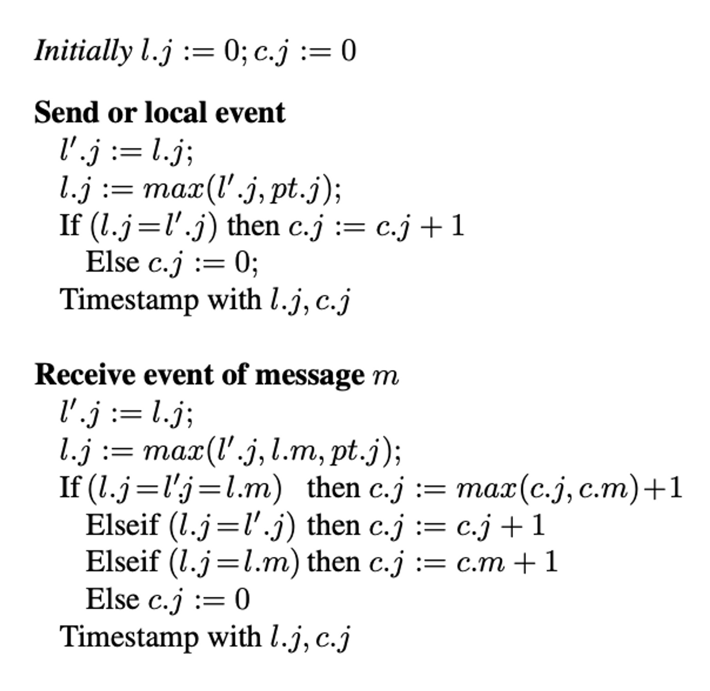

# Hybrid Logical Clock (HLC)

My original goal was to build a distributed key-value database. Since CRDB uses HLC, I also used HLC. Even though I didn't end up building a distributed database, the HLC satisfies the MVCC layer's need for a clock that generates unique, increasing timestamps.

### Motivation behind HLC

Distributed databases need a way to order events and requests. Physical clocks are not reliable as they can go out of sync between servers. Logical clocks can be used to define order across nodes but it does not correlate to physical time. So you cannot perform queries with respect to the physical time.

A hybrid logical clock (HLC) uses a combination of the system timestamp and logical timestamp to have versioned timestamps that can be ordered but still be tied to the physical time.

### Algorithm

The correctness and algorithm for the Hybrid Logical Clock are presented [in this research paper](https://cse.buffalo.edu/tech-reports/2014-04.pdf). In this blog, I will focus on the algorithm and not its correctness.

This is the algorithm presented in the paper. Let me explain how it works.

An HLC’s timestamp has a physical timestamp and a logical timestamp. In this algorithm,

- `l.j` refers to the biggest physical time the node knows so far.
- `c.j` refers to the logical component of the hybrid logical clock, which is used to distinguish two timestamps if their physical component is the same.
- `pt.j` refers to the node’s physical time.

Each HLC has two methods: send_message and receive_message.

**receive_message**

This method determines the HLC’s time after receiving a message. The idea is that an HLC keeps track of the latest physical timestamp and logical timestamp known to the node. Each time it receives a message, it updates the latest timestamp if the message’s timestamp is greater than the latest timestamp.

- First, set the latest physical timestamp (set l.j) to the max of :
  - the current clock’s physical time
  - the incoming message’s physical time
  - the previous latest physical timestamp.
- Next, determine the logical component of the clock (c.j) as follows:
  - If the incoming message’s physical time is the greatest, set the logical clock to the incoming message’s timestamp’s logical time + 1
  - If the current clock’s physical timestamp is the greatest, then use 0 as the logical time
  - If the original latest_timestamp’s physical time is the greatest, then increment the logical component by one

**send_message**

This method determines what timestamp to attach to the message sent to other nodes.

- if the current physical time is bigger than the latest physical time, then use the current physical time with the logical clock set to 0
- Otherwise, increment the latest timestamp’s logical time and use that as the timestamp attached to the message
