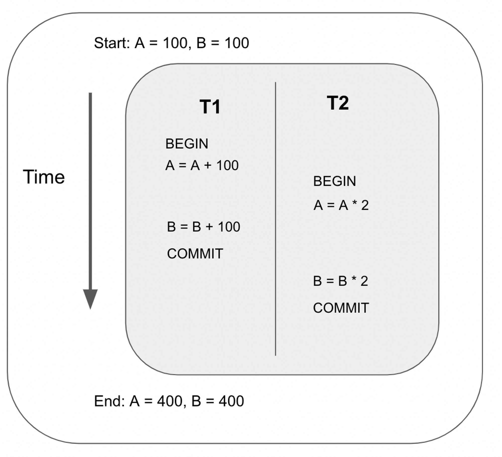
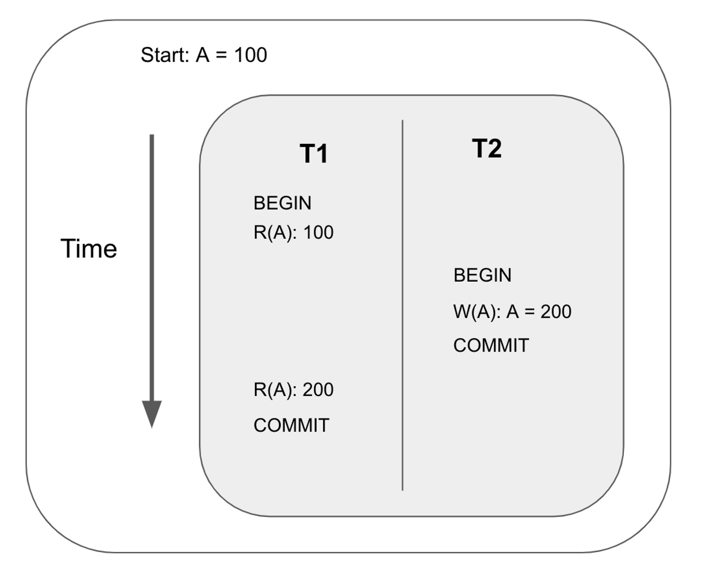

# Concurrency Anomalies

For those familiar with concepts like read-write, write-write, and write-read anomalies, feel free to skip this page!

### Interleaving transactions

Databases are allowed to interleave transactions as long as isolation and atomicity are maintained. In other words, it just has to maintain the illusion that the transactions are performed sequentially.

For example, suppose we interleave the following two transactions as follows:

The output of the above ordering is exactly the same as the ordering below. Therefore, the schedule above is a Serializable Schedule, since it is equivalent to some serial execution.

### Transaction anomalies

Interleaving transactions may lead to anomalies that break the database’s isolation and atomicity guarantees. There are 3 main types of anomalies:

- read-write conflict
- write-read conflict
- write-write conflict

### Read-write conflict

Also known as unrepeatable reads. This happens when two reads of the same transaction yield different results even though the transaction is not responsible for the change in value.

### Write-read conflict

Also known as dirty read. This happens when a transaction reads an uncommitted write by another transaction.

### Write-write conflict

Also known as overwriting uncommitted data or lost update. This happens when a transaction overwrites another transaction’s uncommitted write. In this example, T1’s first write to key A is lost when transaction 2 commits.

Now that we understand the possible conflicts that may occur in concurrent transactions, let's look at how CRDB deals with these conflicts.
