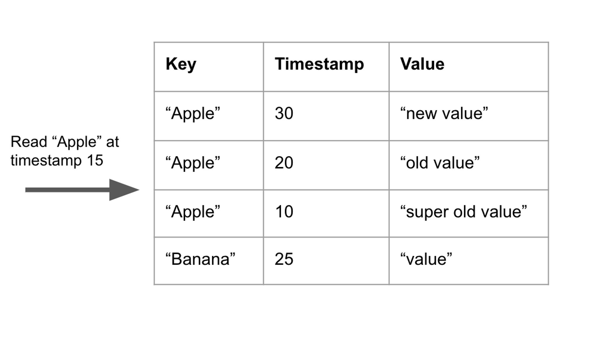
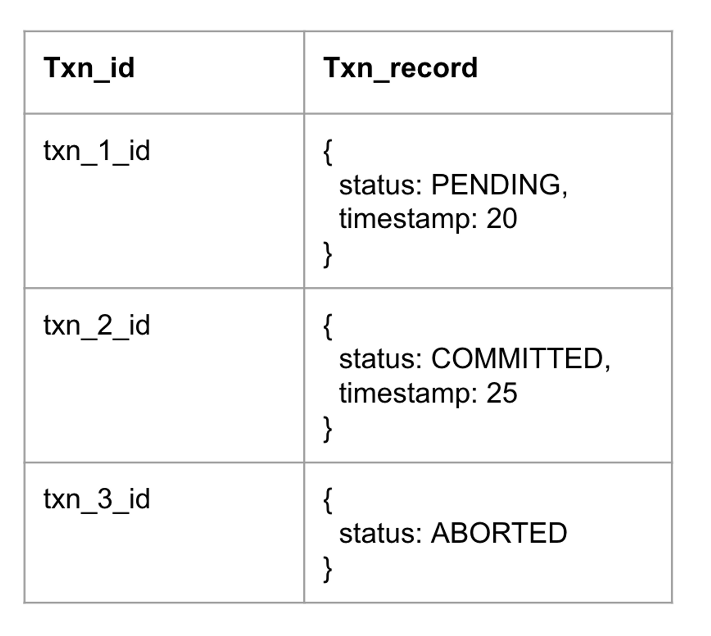

# MVCC

Multiversion concurrency control (MVCC) is an optimization technique used by databases to improve the performance of concurrent operations. The idea behind MVCC is that the database stores multiple versions for each record.

When a record is updated or added, a new entry in the database is added instead of overwriting the original entry. Database reads are performed at a certain version or timestamp. The database returns the most up-to-date record less than or equal to the specified read version.

In the example below, there are 3 different versions of the “Apple” key, each with a different timestamp. The read is performed at timestamp 15. The database returns the result at timestamp 10 since that is the record with the largest timestamp less than 15.

### Write Intent

A single transaction may perform multiple writes. Before the transaction is committed, the uncommitted writes must not be read by other transactions. To address this problem, write intent is introduced (I learned about this concept from CockroachDB).

A write intent is a record stored in the MVCC database to represent uncommitted writes. It is given an INTENT timestamp that distinguishes it from normal timestamps. Each key must only have at most one write intent.

In the example above, there is an uncommitted write with an INTENT timestamp for the "Apple" key. The table stores additional metadata, including the transaction ID and the write timestamp, for the write intent.

### Transaction Record

A transaction may create multiple write intents. The visibility of the uncommitted intent for a transaction must be flipped atomically. This is the job of _transaction records_.

The database stores a transaction record for each transaction in a separate database namespace. The key of the transaction records is the transaction ID and the value contains the status and timestamp for each transaction.

When the transaction is committed, the transaction record is marked as committed. All the write intents are readable by other transactions at this moment.

The timestamp in a committed transaction record is the transactions commit timestamp. Since each timestamp in the database is guaranteed to be unique, each committed transaction has a unique commit timestamp. This guarantees serial execution order of transactions.
