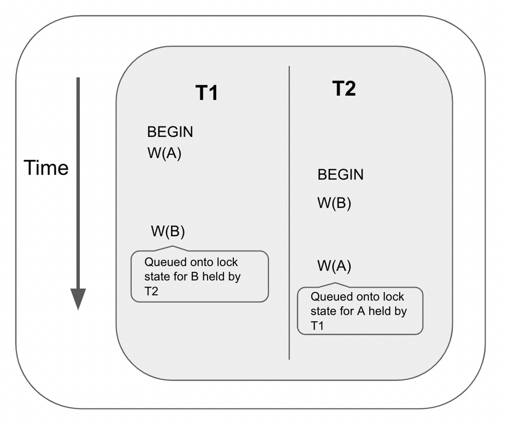
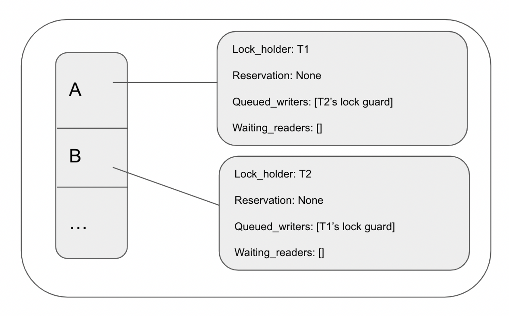

# Deadlock Detection

Deadlocks can happen if two conflicting transactions are waiting for each other to finish.



In the example above, T1 performs a write at A then T2 performs a write at B. Then T1 tries to perform a write at B, but the request gets queued to the lock table as T2 holds the lock at B. On the other hand, T2 tries to perform a write at A, but the request gets queued to the lock table as TA holds the lock at A.

At this point, the lock table looks like this:



This is a deadlock as neither transaction can proceed as they are waiting for the other transactions to resolve.

To deal with situations like this, CockroachDB introduced [TxnWaitQueue](https://www.cockroachlabs.com/docs/stable/architecture/transaction-layer.html#txnwaitqueue), a data structure that can detect deadlocks.

### TxnWaitQueue

TxnWaitQueue is a map from blocking transactions to blocked transactions. We call a blocked transaction a `pusher` and call a blocking transaction a `pushee`. In other words, TxnWaitQueue is a map from `pushee`s to a list of `pusher`s.

If we have a three-way deadlock, TxnWaitQueue may look something like this:

```
txn1 -> [txn2]
txn2 -> [txn3]
txn3 -> [tx1]
```

Each pusher is wrapped around a data structure called `WaitingPush`:

```rust
struct WaitingPush {
    dependents: RwLock<HashSet<Uuid>>,
    txn_id: Uuid,
    /**
     * Notifies the receiver that the pushTxn request has succeeded.
     * In other words, the pushee has finalized (aborted or committed)
     */
    sender: Arc<Sender<()>>,
    /**
     * The receiver will receive a message if the pushee's transaction
     * has finalized
     */
    pushee_finalized_receiver: Mutex<Receiver<()>>,
}
```

The `WaitingPush` has a property called dependents that tracks the list of transactions that are blocked by the pusher’s transaction.

The `TxnWaitQueue` is a map from pushees’ transaction IDs to their lists of `Vec<WaitingPush>`.

The algorithm works as follows:

- a request performing a read or a write detects a conflicting lock so it queues itself to the lock. It starts a timer. If the timer times out before the lock is resolved, the request tries to push the transaction
- the request pushes itself as a `WaitingPush` onto the txnWaitQueue. The request’s transaction is the pusher and the lock holder’s transaction is the pushee. The thread would then wait until either the pushee transaction has resolved or if it detects a cycle.
- To detect a cycle, the pusher periodically queries for its own transitive dependents. Its transitive dependents are computed by looking up its own list of waitingPushes and each waitingPush’s dependents list. For example, if `txnA` queries for its dependents and the `txnWaitQueue` entry for `txnA` looks like this:

```rust
txnA: [
	waitingPush { txn: txnB, dependents: [txnC, txnD] },
	waitingPush { txn: txnE, dependents: [txnF] },
	waitingPush { txn: txnG, dependents: [txnH, txnI] }
]
```

- then the `txnA`'s transitive dependents are `[txnB, txnC, ... txnH, txnI]`. If the pusher detects that its `pushee` is inside its transitive dependents, then a deadlock is detected as there is cyclic dependency. In that case, it tries to abort the `pushee`'s transaction.
- If no deadlock is detected, the pusher updates its own `waitingPush`'s dependents to be its transitive dependents.

Let’s see how we can use the algorithm to detect a deadlock with a basic example [provided by CockroachDB](https://github.com/cockroachdb/cockroach/blob/530100fd39cc722bc324bfb3869a325622258fb3/pkg/kv/kvserver/concurrency/concurrency_control.go#L886).

Let’s suppose the following happens:

- txnA enters txnB’s txnWaitQueue as a waitingPush
- txnB enters txnC’s txnWaitQueue as a waitingPush
- txnC enters txnA’s txnWaitQueue as a waitingPush

```
txnA: [ waitingPush { txn: txnC, dependents: [] } ]
txnB: [ waitingPush { txn: txnA, dependents: [] } ]
txnC: [ waitingPush { txn: txnB, dependents: [] } ]
```

TxnA queries for its dependents and adds it to its waitingPush

```
txnA: [ waitingPush { txn: txnC, dependents: [] } ]
txnB: [ waitingPush { txn: txnA, dependents: [txnC] } ]
txnC: [	waitingPush { txn: txnB, dependents: [] } ]
```

TxnB queries for its dependents and adds it to its waitingPush

```
txnA: [ waitingPush { txn: txnC, dependents: [txnB] } ]
txnB: [ waitingPush { txn: txnA, dependents: [txnC] } ]
txnC: [	waitingPush { txn: txnB, dependents: [txnA, txnC] } ]
```

TxnB detects that txnC is both a dependent and the pushee, so a deadlock is detected.

From this example, we can see that the intuition behind this algorithm is that each `waitingPush`'s dependent lists keep growing until it detects its own `pushee` in its dependents list.

### TxnWaitQueue API

TxnWaitQueue’s API consists of two methods: wait_for_push and finalize_txn.

**wait_for_push: (pusher_txn_id, pushee_txn_id) → Result<PushTxnResponse, WaitForPushError>**

This method creates a waitingPush and adds it to its pushee’s waitQueue. It will then wait until either the pushee’s transaction is finalized or a deadlock is detected. To detect a cycle, it starts a separate thread that periodically queries for its dependents.

**finalize_txn: (txn_id) → ()**

This method is called when a transaction is resolved (aborted or committed). It removes the transaction from the txnWaitQueue and unblocks all pending waitingPushes.

### Algorithm Implementation

Inside Concurrency Manager’s [SequenceReq](https://github.com/brianshih1/little-key-value-db/blob/66f355d1a03c488c4f0aee5b8dc66796398bb4de/src/concurrency/concurrency_manager.rs#L44), if it [detects](https://github.com/brianshih1/little-key-value-db/blob/66f355d1a03c488c4f0aee5b8dc66796398bb4de/src/concurrency/concurrency_manager.rs#L51) that it needs to wait for a lock to be released, it [calls wait_for](https://github.com/brianshih1/little-key-value-db/blob/66f355d1a03c488c4f0aee5b8dc66796398bb4de/src/concurrency/concurrency_manager.rs#LL53C37-L53C51) on the lock table. When wait_for is called, a timer is created. [If it times out](https://github.com/brianshih1/little-key-value-db/blob/f239e62b5d97ff7754ce61e0f8ca02d889fcb4c2/src/lock_table/lock_table.rs#L266) before the lock has been released, it calls [wait_for_push](https://github.com/brianshih1/little-key-value-db/blob/f239e62b5d97ff7754ce61e0f8ca02d889fcb4c2/src/txn_wait/txn_wait_queue.rs#L187).

After [pushing](https://github.com/brianshih1/little-key-value-db/blob/66f355d1a03c488c4f0aee5b8dc66796398bb4de/src/txn_wait/txn_wait_queue.rs#L197) the pusher onto the pushee’s wait queue, the pusher [begins to periodically query for its transitive dependents](https://github.com/brianshih1/little-key-value-db/blob/66f355d1a03c488c4f0aee5b8dc66796398bb4de/src/txn_wait/txn_wait_queue.rs#L198).

The thread loops until either it detects that the pushee’s transaction has been resolved or a cycle is detected. To accomplish this, the thread [listens to two channels](https://github.com/brianshih1/little-key-value-db/blob/66f355d1a03c488c4f0aee5b8dc66796398bb4de/src/txn_wait/txn_wait_queue.rs#L210) with `tokio::select!`.

The first channel is created by `start_query_pusher_txn_dependents` which periodically queries for the pusher’s dependents and sends the message to this channel. [If a cycle is detected](https://github.com/brianshih1/little-key-value-db/blob/66f355d1a03c488c4f0aee5b8dc66796398bb4de/src/txn_wait/txn_wait_queue.rs#L224), it aborts the pushee’s transaction by [sending](https://github.com/brianshih1/little-key-value-db/blob/66f355d1a03c488c4f0aee5b8dc66796398bb4de/src/txn_wait/txn_wait_queue.rs#L227) a `AbortTxn` request to the task queue.

The second channel is created when the `waitingPush` is [created](https://github.com/brianshih1/little-key-value-db/blob/66f355d1a03c488c4f0aee5b8dc66796398bb4de/src/txn_wait/txn_wait_queue.rs#L81). When a transaction is aborted/committed, [finalize_txn](https://github.com/brianshih1/little-key-value-db/blob/66f355d1a03c488c4f0aee5b8dc66796398bb4de/src/txn_wait/txn_wait_queue.rs#L155) is called which would [loop through the waiting_pushes](https://github.com/brianshih1/little-key-value-db/blob/66f355d1a03c488c4f0aee5b8dc66796398bb4de/src/txn_wait/txn_wait_queue.rs#L160) and [send a message](https://github.com/brianshih1/little-key-value-db/blob/66f355d1a03c488c4f0aee5b8dc66796398bb4de/src/txn_wait/txn_wait_queue.rs#L102) to the [receiver](https://github.com/brianshih1/little-key-value-db/blob/66f355d1a03c488c4f0aee5b8dc66796398bb4de/src/txn_wait/txn_wait_queue.rs#L246) which would terminate the function.

### CockroachDB’s Implementation

The TxnWaitQueue’s data structure and the algorithm to periodically query for the pusher’s transaction are based on CockroachDB’s txnWaitQueue implementation.

Inside [sequenceReqWithGuard](https://github.com/cockroachdb/cockroach/blob/c21c90f93219b857858518d25a8bc061444d573c/pkg/kv/kvserver/concurrency/concurrency_manager.go#L232), if a conflicting lock is found, the concurrency manager calls [WaitOn](https://github.com/cockroachdb/cockroach/blob/c21c90f93219b857858518d25a8bc061444d573c/pkg/kv/kvserver/concurrency/concurrency_manager.go#L329). If WaitOn [times out](https://github.com/cockroachdb/cockroach/blob/c21c90f93219b857858518d25a8bc061444d573c/pkg/kv/kvserver/concurrency/lock_table_waiter.go#L346) before the lock is released, the thread will try to [push the transaction](https://github.com/cockroachdb/cockroach/blob/c21c90f93219b857858518d25a8bc061444d573c/pkg/kv/kvserver/concurrency/lock_table_waiter.go#L378).

[MaybeWaitForPush](https://github.com/cockroachdb/cockroach/blob/c21c90f93219b857858518d25a8bc061444d573c/pkg/kv/kvserver/txnwait/queue.go#L444) would be called as a result. It [creates a waitingPush](https://github.com/cockroachdb/cockroach/blob/c21c90f93219b857858518d25a8bc061444d573c/pkg/kv/kvserver/txnwait/queue.go#L474) and [pushes the pusher to the pushee’s waitingPushes](https://github.com/cockroachdb/cockroach/blob/c21c90f93219b857858518d25a8bc061444d573c/pkg/kv/kvserver/txnwait/queue.go#L478). It then [calls startQueryPusherTxn](https://github.com/cockroachdb/cockroach/blob/c21c90f93219b857858518d25a8bc061444d573c/pkg/kv/kvserver/txnwait/queue.go#L538) which periodically [queries the pusher’s dependent list](https://github.com/cockroachdb/cockroach/blob/c21c90f93219b857858518d25a8bc061444d573c/pkg/kv/kvserver/txnwait/queue.go#L854) and [sends the result via the created channel](https://github.com/cockroachdb/cockroach/blob/c21c90f93219b857858518d25a8bc061444d573c/pkg/kv/kvserver/txnwait/queue.go#L885).

WaitForPush listens to a few channels:

- The queryPusherCh, which is the channel created from `startQueryPusherTxn`. [When the queryPusherCh is signaled](https://github.com/cockroachdb/cockroach/blob/c21c90f93219b857858518d25a8bc061444d573c/pkg/kv/kvserver/txnwait/queue.go#L664), it first [checks if the transaction has been finalized](https://github.com/cockroachdb/cockroach/blob/c21c90f93219b857858518d25a8bc061444d573c/pkg/kv/kvserver/txnwait/queue.go#L665), and returns nil if it is. Otherwise, `waitForPush` [checks for the dependency cycle](https://github.com/cockroachdb/cockroach/blob/c21c90f93219b857858518d25a8bc061444d573c/pkg/kv/kvserver/txnwait/queue.go#L682). A pusher detects a cycle if the pushee’s txn ID is in its own dependents. [If there is a dependency, it aborts one of the transactions](https://github.com/cockroachdb/cockroach/blob/c21c90f93219b857858518d25a8bc061444d573c/pkg/kv/kvserver/txnwait/queue.go#L707).
- The [pending channel](https://github.com/cockroachdb/cockroach/blob/c21c90f93219b857858518d25a8bc061444d573c/pkg/kv/kvserver/txnwait/queue.go#L593) is a [property on the waitingPush](https://github.com/cockroachdb/cockroach/blob/530100fd39cc722bc324bfb3869a325622258fb3/pkg/kv/kvserver/txnwait/queue.go#L134). This channel receives an update whenever the pushee’s queue is cleared.
