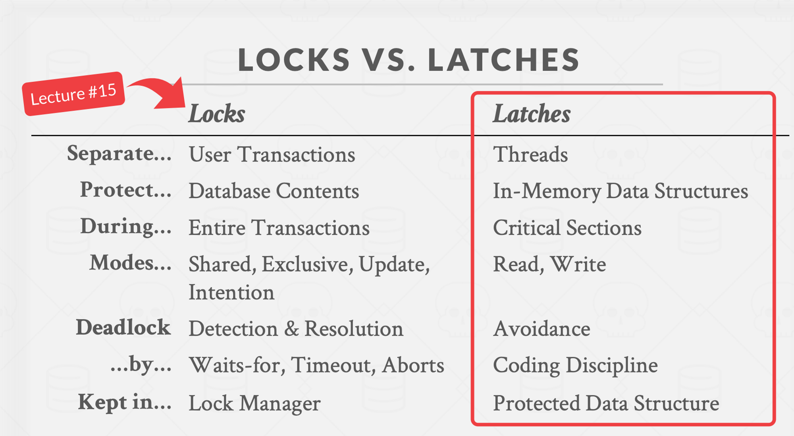

# Latch Manager

The Latch Manager’s job is to serialize/isolate access to keys. This is necessary for the concurrency manager to provide isolation to requests to safely read/write from the MVCC layer. Without isolation, concurrent reads/writes to the MVCC may result in race conditions.

### Latch Manager API

Latch Manager’s API is composed of two methods: Acquire and Release

**Acquire: (keys) → LatchGuard**

Acquire takes a set of keys and returns a latch guard. Once the latch guard is obtained, any other calls to Acquire will have to wait until the latch guard is released. In other words, a thread has isolation for the keys after calling Acquire.

**Release: (LatchGuard) → ()**

Release releases the latch guard, allowing other requests to acquire the latches.

### Building a Thread-safe B+ Tree

The Latch Manager is implemented with a thread-safe B+ Tree. Before talking about how the Latch Manager is implemented with a B+ tree, let’s first talk about how the concurrent tree is implemented.

If you’re not interested in learning how the concurrent B+ tree is implemented, scroll down to the section `Using the Thread-Safe B+ Tree to implement Latch Manager`.

There are plenty of online materials about what B+ trees are so I won’t go into too much detail. In summary, the B+ tree is a self-balancing m-ary tree. A B+ tree is made up of root, internal nodes, and leaf nodes.

B+ tree has a few invariants. For example, every internal node has at least floor(m/2) children, all leaves are at the same distance from the root, etc. To maintain these invariants, nodes may split into multiple nodes, steal from siblings nodes, or merge with sibling/parent nodes during insertion and deletion.

When implementing the B+ tree, I relied heavily on this [B+ visualization tool](https://dichchankinh.com/~galles/visualization/BPlusTree.html). The visualization tool provides step-by-step visualizations for B+ tree algorithms. For example, here are the steps for a `Delete` operation.


### Latch Crabbing/Coupling

What makes a thread-safe B+ tree different from normal B+ is that a thread-safe B+ tree can be accessed by multiple threads concurrently. If not designed correctly, threads can crash or yield incorrect results if they try to modify the same set of nodes concurrently.

This is where Latch Crabbing (or coupling) comes in. Latch crabbing is a protocol to allow multiple threads to access and modify the B+ tree concurrently. This is covered in CMU’s lecture (check out their [lecture slide](https://15445.courses.cs.cmu.edu/fall2022/slides/09-indexconcurrency.pdf) and [video](https://www.youtube.com/watch?v=5KClozM1jjw&list=PLSE8ODhjZXjaKScG3l0nuOiDTTqpfnWFf&index=9&ab_channel=CMUDatabaseGroup)).

Latches are lightweight synchronization objects that protect a data structure from concurrent access. If a read latch for a node, no other threads can perform mutation to that node. If a write latch is held for a node, no other threads can read or write that node.

The idea behind latch crabbing is that when traversing the B+ tree, the thread would get a latch on the parent (starting from the root) before getting a latch on the child node. Then the latch for the parent node is released only if it is safe to do so. It is safe to release the latch for the parent node if it will not split or merge when modified. Whether a node is safe depends on what kind of operation the thread is executing:

- `Deletion`: a node is safe when it is more than half-full (otherwise it will merge with another node when a key is deleted).
- `Insert`: a node is safe when it is not full (otherwise it will split when a key is inserted).

In my B+ tree implementation, latches are implemented with `RwLock`s. Each node is wrapped around a `RwLock`.

```rust
pub type LatchNode<K> = Arc<RwLock<Node<K>>>;

pub enum Node<K: NodeKey> {
    Internal(InternalNode<K>),
    Leaf(LeafNode<K>),
}
```

Furthermore, each property inside the InternalNode and LeafNode are also wrapped around RwLock to provide interior mutability.

```rust
pub struct InternalNode<K: NodeKey> {
    pub keys: RwLock<Vec<K>>,
    // a key's corresponding left edge will contain nodes with keys stricly less
    // than the key
    pub edges: RwLock<Vec<NodeLink<K>>>,
    pub order: u16,
}

pub struct LeafNode<K: NodeKey> {
    pub keys: RwLock<Vec<K>>,
    pub left_ptr: WeakNodeLink<K>,
    pub right_ptr: WeakNodeLink<K>,
    pub order: u16,
    pub waiters: RwLock<Vec<RwLock<LatchWaiters>>>,
}

pub type NodeLink<K> = RwLock<Option<LatchNode<K>>>;
pub type WeakNodeLink<K> = RwLock<Option<Weak<RwLock<Node<K>>>>>;
```

To be honest, I struggled quite a bit implementing the concurrent B+ tree. This was my first time learning Rust and I had to wrestle with the compiler multiple times. One thing I struggled with when implementing [insert](https://github.com/brianshih1/little-key-value-db/blob/f239e62b5d97ff7754ce61e0f8ca02d889fcb4c2/src/latch_manager/latch_interval_btree.rs#L985) and [delete](https://github.com/brianshih1/little-key-value-db/blob/f239e62b5d97ff7754ce61e0f8ca02d889fcb4c2/src/latch_manager/latch_interval_btree.rs#L1117) was finding a way to store the latches.

I originally tried to keep a stack of `RwLockWriteGuard` as I traversed the tree. But Rust doesn’t compile because the guard at `stack[n]` references the Arc from `stack[n-1]`. In Rust, the value and the reference to that value cannot belong to the same struct. It took me a while to realize that taking a recursive approach when implementing tree algorithms in Rust is easier - the recursion creates a stack for us in the form of the call stack.

Going back to latch coupling, this is how we [compute whether a node is safe or not](https://github.com/brianshih1/little-key-value-db/blob/f239e62b5d97ff7754ce61e0f8ca02d889fcb4c2/src/latch_manager/latch_interval_btree.rs#L914) during insertion:

```rust
let is_safe = child_node_size < usize::from(self.order - 1);
```

We make sure that the child isn’t at capacity yet so won’t split if a key is inserted.

This is how we [compute whether a node is safe or not](https://github.com/brianshih1/little-key-value-db/blob/f239e62b5d97ff7754ce61e0f8ca02d889fcb4c2/src/latch_manager/latch_interval_btree.rs#L1058) during deletion.

```rust
let is_safe = child_has_spare_key
	& !is_edge_key_the_delete_key && is_ancestor_safe;
```

We make sure that the child is at least half full (has spare key) so that it won’t merge with the parent node if a key is deleted.

To clarify, the latches here aren’t the same latches we refer to when we talk about the latch that is acquired through the `Acquire` method in the Latch Manager. The latches here are used to protect the B+ tree data structure. The latches acquired by a latch manager functions more as a lock.

### Writing Unit Tests

When writing unit tests for tree algorithms, I like to write declarative tests. Instead of having to imperatively build a B+ tree to a starting state, I used a test data structure that can be used to generate a B+ tree. For example, here is the code to create a tree.

```rust
let test_node = TestNode::Internal(TestInternalNode {
    keys: Vec::from([10]),
    edges: Vec::from([
        Some(TestNode::Leaf(TestLeafNode {
            keys: Vec::from([5]),
        })),
        Some(TestNode::Leaf(TestLeafNode {
            keys: Vec::from([10, 20]),
        })),
    ]),
});
let tree = create_test_tree(&test_node, 3);
```

After performing the mutation algorithms, I then asserted the resulting B+ tree as follows

```rust
tree.insert(Range {
    start_key: 15,
    end_key: 15,
});
let test_node = TestNode::Internal(TestInternalNode {
    keys: Vec::from([10, 15]),
    edges: Vec::from([
        Some(TestNode::Leaf(TestLeafNode {
            keys: Vec::from([5]),
        })),
        Some(TestNode::Leaf(TestLeafNode {
            keys: Vec::from([10]),
        })),
        Some(TestNode::Leaf(TestLeafNode {
            keys: Vec::from([15, 20]),
        })),
    ]),
});
assert_tree(&tree, &test_node);
```

Feel free to check out the [unit tests](https://github.com/brianshih1/little-key-value-db/blob/f239e62b5d97ff7754ce61e0f8ca02d889fcb4c2/src/latch_manager/latch_interval_btree_test.rs) I wrote for the my concurrent B+ tree implementation!

### Using the Thread-Safe B+ Tree to implement Latch Manager

So far, we’ve mostly talked about how to implement the concurrent B+ tree. Now, let’s talk about how the B+ tree is actually used to implement the Latch Manager API.

**Acquire**

As a refresher, Acquire takes a set of keys and returns a Latch Guard. Once a latch guard is acquired by a thread, other threads would have to wait until the latch guard is released.

Based on this requirement, there are a few mechanisms we need to design for:

- a thread calling Acquire needs to be able to detect that the latches are currently owned by another thread.
- a thread calling Acquire that is waiting for another thread to release its latches needs to be able to detect when the latch guards are released

Each key inside the B+ tree’s leaf nodes represents an acquired latch. A thread can detect that a latch for a key is acquired by checking if the key exists in the B+ tree.

When a latch is released, the database uses message passing to notify the waiting thread that it can stop waiting.

The B+ tree’s insert API is `insert: (key) → LatchKeyGuard`.

LatchKeyGuard is an enum:

```rust
pub enum LatchKeyGuard {
    Acquired,
    NotAcquired(LatchGuardWait),
}

pub struct LatchGuardWait {
    pub receiver: Receiver<()>,
}
```

During Acquire, the thread would first try to insert the key into the B+ tree. If the key doesn’t exist in the B+ tree yet, the key is inserted, and `LatchKeyGuard::Acquired` is returned. Otherwise, a channel is created and the sender is queued onto the latch. The function then returns `LatchKeyGuard::NotAcquire` along with the receiver. The thread can then wait for the receiver to receive a message that the latch has been released. [Here](https://github.com/brianshih1/little-key-value-db/blob/master/src/latch_manager/latch_manager.rs#L46) is the code for that.

Each key in the `LeafNode` contains a corresponding `LatchWaiters`. Each LatchWaiter contains an array of senders, each has a corresponding `receiver` returned by the `Insert` method.

```rust
pub struct LeafNode<K: NodeKey> {
    pub keys: RwLock<Vec<K>>,
		...
    pub waiters: RwLock<Vec<RwLock<LatchWaiters>>>,
}

pub struct LatchWaiters {
    pub senders: Vec<Mutex<Sender<()>>>,
}
```

Each key in the `LeafNode` contains a corresponding `LatchWaiters`. Each LatchWaiters contains an array of senders, which are requests waiting for the latch guard to be released.

Deadlock is possible with this approach. For example, suppose both `request 1` and `request 2` want to Acquire latches for the keys `A` and `B`. If `request 1` acquires key A first and `request 2` acquires key B first, then a deadlock has occurred since the two requests are blocking each other.

To deal with the deadlock, we use a timeout approach. `Acquire` would release all guards and retry [if the timer times out](https://github.com/brianshih1/little-key-value-db/blob/master/src/latch_manager/latch_manager.rs#L51). There are likely better ways to deal with deadlocks but this was good enough for a MVP.

**Release**

Release is fairly simple. All it does is it [iterates through the latches that it acquired and deletes it from the B+ tree](https://github.com/brianshih1/little-key-value-db/blob/master/src/latch_manager/latch_manager.rs#L84). The B+ tree would then notify the waiters that the latch is released.

### Terminologies

You are probably wondering - the “latches” acquired by the latch manager sound more like a lock. In fact, if we look at this [slide](https://15445.courses.cs.cmu.edu/fall2022/slides/09-indexconcurrency.pdf) from CMU’s lecture, we can see that latches are supposed to be short-lived and don’t rely on mechanisms such as Waits-for, Timeout, etc.



To clarify, the RwLock protecting the internal nodes of the B+ tree function as latches. The leaf nodes that contain a queue of waiters act more like a lock (though not a transaction lock).

### **CockroachDB’s Latch Manager**

For reference, [this](https://github.com/cockroachdb/cockroach/blob/530100fd39cc722bc324bfb3869a325622258fb3/pkg/kv/kvserver/concurrency/concurrency_control.go#L489) is CockroachDB’s API for the latch manager. My Latch Manager’s API is inspired by CockroachDB’s Latch Manager API but my implementation is different. In [this doc](https://github.com/cockroachdb/cockroach/blob/530100fd39cc722bc324bfb3869a325622258fb3/pkg/kv/kvserver/concurrency/concurrency_control.go#L489), CockroachDB outlines the evolution of its latch manager implementation.

CockroachDB uses an interval tree of RWMutexes. [This CockroachDB PR](https://github.com/cockroachdb/cockroach/commit/c855b45b539d8870a8d3f9f0711c900b95e0d36c) introduces a BTree implementation based on immutable data structures with copy-on-write mechanisms. I wasn’t able to fully understand how it works but I might revisit and build another implementation for my Latch Manager in the future!
